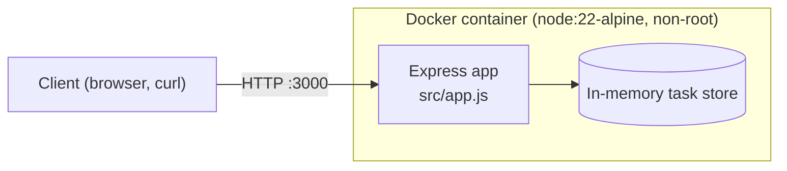
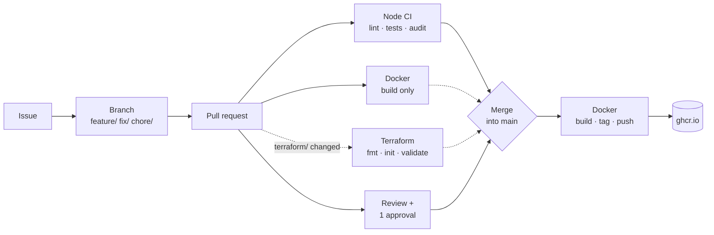

# DevOps Platform Challenge

[](https://github.com/Infernoflamex/platform-challenge/actions/workflows/node-ci.yml)
[](https://github.com/Infernoflamex/platform-challenge/actions/workflows/docker.yml)
[](https://github.com/Infernoflamex/platform-challenge/actions/workflows/terraform.yml)

A small Node.js task API used to practise a complete, professional delivery workflow:

**Issue → Branch → Code → Pull Request → Review → Approval → Merge → CI → Container → Package → Infrastructure validation**

The application itself is intentionally simple. The focus of the project is everything around it: collaboration on GitHub, automated tests, a container image published by CI/CD, and Terraform validation in CI.

## Architecture



| Component | Description |
|---|---|
| **Express API** (`src/app.js`) | HTTP routes for health checks and task management |
| **Task store** | In-memory array shared by all `/tasks` routes: tasks are lost when the application restarts |
| **Tests** (`test/`) | Automated tests using Node's built-in test runner (`node:test`) |
| **Dockerfile** | Production image: Node 22 on Alpine, production dependencies only, runs as a non-root user |
| **GitHub Actions** (`.github/workflows/`) | Node CI, Docker build and publish, Terraform validation |
| **Terraform** (`terraform/`) | Infrastructure-as-code configuration, validated in CI (no cloud provider) |

### Project structure

```text
.
├── .github/
│   ├── ISSUE_TEMPLATE/           # Bug report and feature request templates
│   ├── pull_request_template.md  # Checklist used by every pull request
│   └── workflows/                # node-ci.yml, docker.yml, terraform.yml
├── src/                          # Application code
├── test/                         # Automated tests
├── terraform/                    # Terraform configuration (validation only)
├── .dockerignore
├── .gitignore
├── CONTRIBUTING.md               # Branching strategy and contribution rules
├── Dockerfile
├── README.md
├── STUDENT_CHALLENGE.md          # Original challenge brief
├── eslint.config.mjs
├── package.json
└── package-lock.json
```

## API

| Method | Path | Description | Responses |
|---|---|---|---|
| `GET` | `/` | Service information | `200` |
| `GET` | `/health` | Health check (used by the Docker `HEALTHCHECK`) | `200` `{"status":"healthy"}` |
| `GET` | `/total` | Demo endpoint for `calculateTotal` | `200` `{"total":35}` |
| `GET` | `/tasks` | List all tasks | `200` JSON array |
| `POST` | `/tasks` | Create a task from `{"title": "..."}` | `201` created task · `400` missing or empty title |
| `PATCH` | `/tasks/:id` | Update completion from `{"completed": true}` | `200` updated task · `400` invalid input · `404` unknown task |
| `DELETE` | `/tasks/:id` | Delete a task | `204` · `404` unknown task |

A task looks like this:

```json
{ "id": 1, "title": "Write README", "completed": false }
```

Example:

```bash
curl -X POST http://localhost:3000/tasks \
  -H "Content-Type: application/json" \
  -d '{"title": "Write README"}'
```

## Local setup

**Prerequisites:** Node.js 22 or 24 (the versions tested in CI) and npm.

```bash
git clone https://github.com/Infernoflamex/platform-challenge.git
cd platform-challenge
npm ci          # install the exact versions from package-lock.json
npm start       # http://localhost:3000
```

The port can be changed with the `PORT` environment variable, for example `PORT=8080 npm start`.

## Tests

```bash
npm test        # run all tests (node --test)
npm run lint    # check code style with ESLint
```

Tests live in `test/` and use Node's built-in test runner, so no extra test framework is needed. They cover `calculateTotal` and the task endpoints, including their error cases (`400`, `404`). The endpoint tests start the app on a random free port and call it with `fetch`.

Tests must never be deleted or weakened to make CI pass.

## Docker

Build and run the image locally:

```bash
docker build -t devops-platform-challenge .
docker run --rm -p 3000:3000 devops-platform-challenge   # stays in the foreground, stop it with Ctrl+C
```

In a second terminal:

```bash
curl http://localhost:3000/health    # {"status":"healthy"}
```

Image details:

- **Small base image:** `node:22-alpine`, with production dependencies only (`npm ci --omit=dev`)
- **Non-root:** the container runs as the unprivileged `node` user
- **Clean shutdown:** `tini` forwards Ctrl+C and `docker stop` to Node
- **Health check:** Docker calls `/health` every 30 seconds
- **Small build context:** `.dockerignore` keeps `node_modules`, `.git`, tests, Terraform and docs out of the build

### Published image

Every push to `main` publishes the image to the GitHub Container Registry. The package is public, so no login is needed:

```bash
docker pull ghcr.io/infernoflamex/platform-challenge:latest
docker run --rm -p 3000:3000 ghcr.io/infernoflamex/platform-challenge:latest
```

The image is built for `linux/amd64`. On an Apple Silicon Mac, add `--platform linux/amd64` to both commands. Docker Desktop then runs the image under emulation.

## CI/CD



Solid arrows into **Merge** are required by the branch ruleset. Dotted ones run on the pull request but are not required checks.

| Workflow | Runs on | What it does |
|---|---|---|
| **Node CI** (`node-ci.yml`) | Every pull request, push to `main` | `test` job on Node 22 and 24: `npm ci`, `npm run lint`, `npm test`. `audit` job: `npm audit --audit-level=high` |
| **Docker** (`docker.yml`) | Pull requests to `main`, push to `main`, `v*` tags | Builds the image. On `main` and on tags it also logs in to `ghcr.io`, tags the image and pushes it |
| **Terraform** (`terraform.yml`) | Pull requests and pushes to `main` that change `terraform/` or the workflow file itself | `terraform fmt -check`, `terraform init`, `terraform validate` (run in `terraform/`) |

**Image tags** (generated by `docker/metadata-action`):

| Tag | When |
|---|---|
| `latest` | Every push to `main`, and every release tag such as `v1.2.3` |
| `sha-<short commit>` (e.g. `sha-7068f32`) | Every published build, so any version can be traced back to its commit |
| `1.2.3` | When a Git tag `v1.2.3` is pushed |

Pull requests only **build** the image: nothing is published from a pull request. Images are pushed only from `main`, after review and merge, and from `v*` release tags, which should only be created on commits already merged into `main`. The workflow authenticates with the built-in `GITHUB_TOKEN`, so no secret has to be configured.

### Quality gates

`main` is protected by a repository ruleset:

- Changes reach `main` only through a pull request
- At least **1 approval** is required, and new commits dismiss earlier approvals
- All review conversations must be resolved
- The CI checks `test (22)`, `test (24)` and `audit` must pass
- Force pushes and deleting `main` are blocked, and nobody can bypass these rules

A pull request that breaks a test therefore turns CI red and **cannot be merged** until it is fixed and approved.

The Terraform check is not required: it only runs when `terraform/` changes, so on any other pull request a required Terraform check would never report and would block the merge forever.

## Terraform

The `terraform/` folder contains a small Terraform configuration. It defines a variable and an output describing the application, and it **does not declare any cloud provider**. Nothing is ever deployed: the goal is to treat infrastructure code like application code, which means it is formatted, initialised and validated automatically in CI.

Run the same checks locally (requires Terraform 1.5 or later):

```bash
terraform -chdir=terraform fmt -check   # formatting
terraform -chdir=terraform init         # initialise (no provider to download)
terraform -chdir=terraform validate     # syntax and consistency
```

If `fmt -check` fails, run `terraform -chdir=terraform fmt` to fix the formatting.

## Development workflow

### Branching strategy

```text
main                          protected, always working; changes arrive only through reviewed PRs
 ├── feature/<issue>-<name>   new functionality
 ├── fix/<issue>-<name>       bug fixes
 └── chore/<issue>-<name>     CI, Docker, Terraform, documentation
```

Each branch is short-lived and covers exactly one issue. It starts from an up-to-date `main` and is deleted after its pull request is merged.

| Prefix | Example |
|---|---|
| `feature/` | `feature/9-list-tasks` |
| `fix/` | `fix/1-failing-test` |
| `chore/` | `chore/14-docker-ci` |

### From issue to merge

1. **Create an issue** using the *Bug report* or *Feature request* template: problem or user story, plus acceptance criteria.
2. **Create a branch** from an up-to-date `main`, following the naming above.
3. **Commit** with meaningful messages in the imperative mood, for example `Add task status validation`, not `update` or `fix`.
4. **Open a pull request** with the template. Reference the issue (`Closes #9`), explain the changes and how they were tested.
5. **Review:** a teammate reviews the code and leaves at least one technical comment. The author addresses the feedback.
6. **Merge** once CI is green, the PR is approved and all conversations are resolved. The issue closes automatically thanks to `Closes #N`. Then delete the branch with the **Delete branch** button.

See [CONTRIBUTING.md](CONTRIBUTING.md) for a short checklist version of these rules.

## Useful commands

| Command | Description |
|---|---|
| `npm ci` | Install dependencies exactly as locked |
| `npm start` | Start the API on port 3000 |
| `npm test` | Run the tests |
| `npm run lint` | Run ESLint |
| `npm audit --audit-level=high` | Check dependencies for known vulnerabilities |
| `docker build -t devops-platform-challenge .` | Build the image |
| `docker run --rm -p 3000:3000 devops-platform-challenge` | Run the container |
| `docker pull ghcr.io/infernoflamex/platform-challenge:latest` | Pull the published image (add `--platform linux/amd64` on Apple Silicon) |
| `terraform -chdir=terraform fmt -check` | Check Terraform formatting |
| `terraform -chdir=terraform validate` | Validate the Terraform configuration |
| `git checkout main && git pull` | Update your local `main` before starting new work |
| `git checkout -b feature/<issue>-<name>` | Start a new branch |

## Team

| Member | Main contributions |
|---|---|
| [@Infernoflamex](https://github.com/Infernoflamex) | Repository setup, issue/PR templates, branch protection, Docker, Docker CI/CD, Terraform CI, README |
| [@namelessbell92-ai](https://github.com/namelessbell92-ai) | `calculateTotal` bug report and fix PR (#1, #6), `POST /tasks` |
| [@ben7132](https://github.com/ben7132) | `calculateTotal` fix commit (#6), `GET /tasks` |
| [@Ahissata](https://github.com/Ahissata) | Node CI, `DELETE /tasks/:id` |
| [@amaviviekouvo-cyber](https://github.com/amaviviekouvo-cyber) | `PATCH /tasks/:id` |
