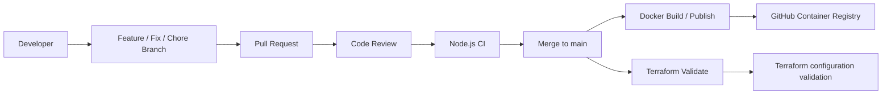

# DevOps Platform Challenge

A small Node.js application used as a DevOps practice project to exercise CI/CD, containerization, quality gates, infrastructure validation, and team GitHub workflow practices.

## Overview

This repository contains a lightweight Express service that exposes a health check and a pricing calculator. The challenge focuses on transforming a basic application into a professional, team-based delivery workflow using GitHub, GitHub Actions, Docker, and Terraform.

The project demonstrates:

- Node.js application development and testing
- Automated CI validation with GitHub Actions
- Docker image build and publishing workflow
- Terraform formatting and validation checks
- Branching, PR review, and protected-branch practices
- Documentation and repository hygiene

## Architecture



## Project structure

```text
.
├── .github/
│   ├── CODEOWNERS
│   └── workflows/
│       ├── node.yml
│       ├── docker.yml
│       └── terraform.yml
├── src/
│   └── app.js
├── test/
│   └── app.test.js
├── terraform/
│   └── main.tf
├── .dockerignore
├── Dockerfile
├── package.json
├── README.md
└── STUDENT_CHALLENGE.md
```

## Application behavior

The service runs on port 3000 and exposes the following endpoints:

- `GET /` — returns the service name and a basic status message
- `GET /health` — health check response
- `GET /total` — calculates the total of a predefined set of items using price × quantity

The core business logic is implemented in `src/app.js` and is validated by unit tests in `test/app.test.js`.

## Local setup

### Prerequisites

- Node.js 20 or newer
- npm
- Docker (for container validation)
- Terraform 1.5+ (for local Terraform checks)

### Install dependencies

```bash
npm install
```

### Run the app locally

```bash
npm start
```

The service listens on:

```text
http://localhost:3000
```

## Testing

Run the unit tests:

```bash
npm test
```

The tests currently validate:

- total calculation for a basket of items
- zero-value behavior for an empty basket
- non-mutation of the input array

## Docker

The repository includes a Dockerfile and a `.dockerignore` file to keep the build context clean and efficient.

### Build the image

```bash
docker build -t devops-platform-challenge .
```

### Run the container

```bash
docker run --rm -p 3000:3000 devops-platform-challenge
```

Then access:

```text
http://localhost:3000
```

## CI/CD workflows

GitHub Actions is used to automate validation steps for code quality and deployment readiness.

### 1. Node.js CI

Workflow: `.github/workflows/node.yml`

This workflow runs on pushes and pull requests to `main` and validates:

- dependency installation with `npm ci`
- unit tests with `npm test`
- linting with `npm run lint`

### 2. Docker CI/CD

Workflow: `.github/workflows/docker.yml`

This workflow:

- checks out the repository
- sets up Docker Buildx
- builds the container image
- authenticates to GitHub Container Registry
- pushes the image on the default branch

### 3. Terraform validation

Workflow: `.github/workflows/terraform.yml`

This workflow validates the infrastructure definition by running:

```bash
terraform fmt -check -recursive
terraform init -backend=false
terraform validate
```

It is triggered when Terraform files or the workflow itself change.

## Terraform

The Terraform config is intentionally minimal and serves as a validation example for infrastructure-as-code quality checks.

File:

- `terraform/main.tf`

It defines:

- the Terraform required version
- a default application name variable
- a local metadata block
- an output exposing the application metadata

This validates the configuration without any cloud deployment, which matches the challenge constraints.

## Team workflow and GitHub practices

The repository is designed around a healthy GitHub collaboration flow:

```text
main
├── feature/...
├── fix/...
├── chore/...
```

Recommended process:

1. Create an issue for the work to be done.
2. Create a dedicated branch.
3. Implement the fix or feature.
4. Open a pull request.
5. Ask for review from another team member.
6. Ensure CI checks pass.
7. Merge only after approval and validation.

This project also includes a CODEOWNERS file to help assign ownership and review responsibility for repository paths.

## Useful commands

```bash
# install dependencies
npm install

# run tests
npm test

# run app
npm start

# lint code
npm run lint

# docker build
docker build -t devops-platform-challenge .

# docker run
docker run --rm -p 3000:3000 devops-platform-challenge

# terraform validation
cd terraform
terraform fmt -check -recursive
terraform init -backend=false
terraform validate
```

## Notes

This project is intentionally structured as a learning platform for DevOps practices. It combines application development, automation, review discipline, and infrastructure validation in a single repository, giving a realistic view of how software delivery is managed in a team environment.
